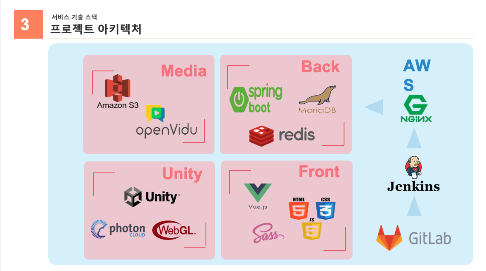

 <p align="center"></p>


## 📆 신기한 싸피버스


- 진행 기간 : 2021.10.11 ~ 2021.11.26
- 목표: 싸피 광주 캠퍼스 메타버스 플랫폼  


  - Unity를 활용한 광주 캠퍼스 환경을 재현하여 집에서도 캠퍼스를 즐길 수 있습니다.
  - 스터디룸을 예약하고 팀원들과 랜선 스터디를 진행할 수 있습니다.
  - 헬프게시판을 이용하여 자신의 코드를 공유하여 도움을 받을 수 있습니다.
  - 모든형식의 자료들을 팀원들과 공유할 수 있고 팀원들은 다운받아 볼 수 있습니다.
  - '무엇이든 물어보세요'  무물 게시판에서 익명으로 QNA를 진행할 수 있습니다.


- [개발문서]()

<br>


## ⭐️주요 기능

### Unity 3D 캠퍼스

> 싸피 캠퍼스를 3D 모델링하여 현실과 비슷하게 설계하였습니다.


### 스터디룸

> 스터디룸을 예약하고 우리만의 방을 생성하여 화상회의,화면공유, 채팅을 지원합니다.


### 공유게시판

> 원하는 사람에게 자료를 공유할수 있는 공유게시판입니다.


### 출석체크

> 출석인증을 위한 출석체크, 방명록을 남길 수 있습니다.


### 무물 

> '무엇이든 물어보세요'
>
> 익명인점을 이용하여 비대면 수업에서 조금 더 친해지기 위한 익명게시판입니다.


### 헬프게시판

> Markdown 기반의 헬프게시판을 통한 문제 해결 커뮤니티입니다.


## ❔ 서비스 아키텍쳐





## 🎞 최종산출물


- [발표자료](https://drive.google.com/file/d/1utqRM5L9R8FpSjrZKSj8o-H1APt00476/view?usp=sharing)


- [UCC]()


## 😋 Installation


- Frontend


```bash
$ cd frontend
$ npm i
$ npm run serve
```


- Backend


```bash
# API server 
$ cd Backend
$ gradle wrap # gradle wrapper 없을 경우 실행
$ ./gradlew clean build
$ sudo java -jar build/libs/backend-0.0.1-SNAPSHOT.jar

# openvidu + KMS
$ docker run -p 4443:4443 --rm -e OPENVIDU_SECRET=MY_SECRET openvidu/openvidu-server-kms:2.20.0
```


## 🐤 Server Description


- port (nginx)


- | 443               | server default(https)                                        |
    | ----------------- | ------------------------------------------------------------ |
    | **80**            | server default(http) (redirect to 443)                       |
    | **5443**          | openvidu (Spring boot running)                               |
    | **8080**          | REST API (Spring boot running) (reverse proxy)               |
    | **3306**          | MariaDB                                                      |
    | **9090**          | Jenkins CI/CD                                                |
    | **3478**          | used by TURN server to resolve clients IPs.                  |
    | **40000 - 57000** | used by Kurento Media Server to establish media connections. |
    | **57001 - 65535** | used by TURN server to establish relayed media connections.  |


## ⚙ 개발 환경 및 IDE


### ✨Front-End 


- **지원 환경** : Web,Unity
- **담당자** : 김보민, 김용재, 송지현

<details>
    <summary>Front 자세히 살펴보기 🌈</summary>
    <ul>
        <li>기술스택 ⚙</li>
    </ul>   
    <ul>
      	<li>Vue.js @2.6.11</li>
      	<li>Unity</li>
      	<li>Openvidu</li>
      	<li>WebGL</li>
        <li>JS, HTML, CSS</li>
        <li>SCSS</li>
    </ul>
    <li>--------------------------------------------------------------------------------------</li>
    <ul>
        <li>라이브러리 📚</li>
    </ul>   
    <ul>
        <li>"@toast-ui/vue-editor": "^3.1.1",</li>
        <li>"axios": "^0.23.0",</li>
        <li>"bootstrap": "^5.1.3",</li>
        <li>"bootstrap-vue": "^2.21.2",</li>
        <li>"core-js": "^3.6.5",</li>
        <li>"inko": "^1.1.1",</li>
        <li>"node-sass": "^6.0.1",</li>
        <li>"openvidu-browser": "^2.20.0",</li>
        <li>"sass-loader": "^10.2.0",</li>
        <li>"simple-code-editor": "^1.0.5",</li>
        <li>vue": "^2.6.14",</li>
        <li>"vue-router": "^3.5.2",</li>
        <li>"vue-unity-webgl": "^1.2.0",</li>
        <li>"vuetify": "^2.5.10",</li>
        <li>"vuex": "^3.6.2",</li>
        <li>"vuex-persistedstate": "^4.1.0"</li>
    </ul>
</details>


### 💻Back-End


- **담당자** : 김윤빈, 임광훈
<details>
    <summary>Backend 자세히 살펴보기 🌈</summary>
    <ul>
        <li>기술스택 ⚙</li>
    </ul>   
    <ul>
        <li>Spring-boot</li>
      	<li>Spring-Security</li>
      	<li>Spring Data Jpa</li>
      	<li>Redis</li>
        <li>AWS EC2</li>
        <li>Docker</li>
        <li>Jenkins</li>
        <li>Mariadb</li>
        <li>AWS S3</li>
      	<li>Photon</li>
    </ul>
</details>


## 👨‍👩‍👦팀원 소개

**임광훈**


- 🐮Github: [@ImGwanghun](https://github.com/Gwanghun-Im)

**송지현**


- 🌰Github: [@jihyeon-songb](https://github.com/jihyeon-songb)

**김보민**


- 🧙‍♂️Github: [@bomin1](https://github.com/bomin1)

**김용재**


- 🍒Github: [@kimyoungjae](https://github.com/rubetyy)

**김윤빈**


- 🐶Github : [@kimyunbin](https://github.com/kimyunbin)


